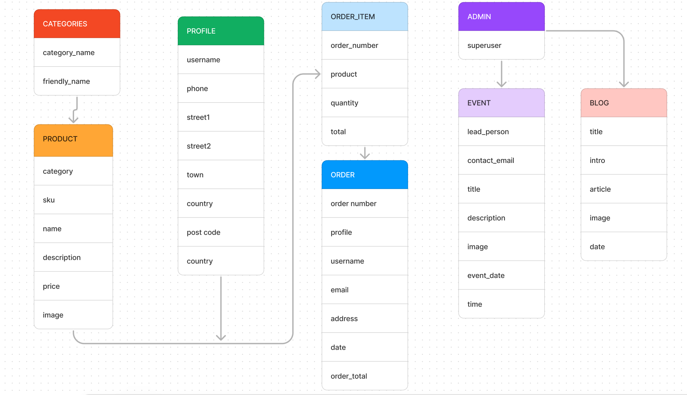
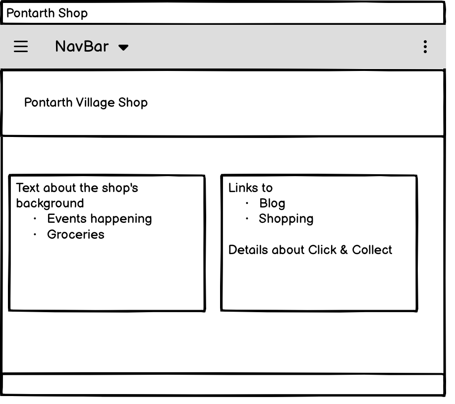
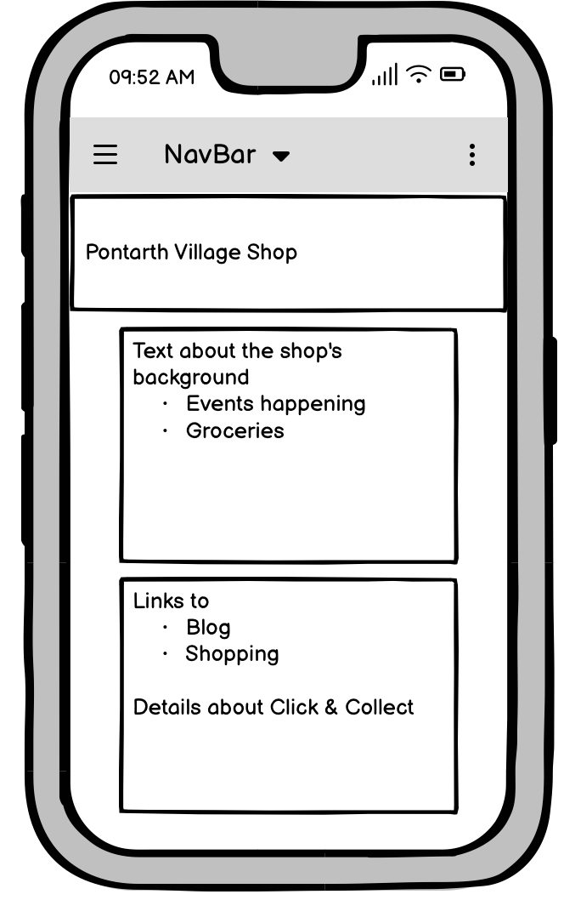
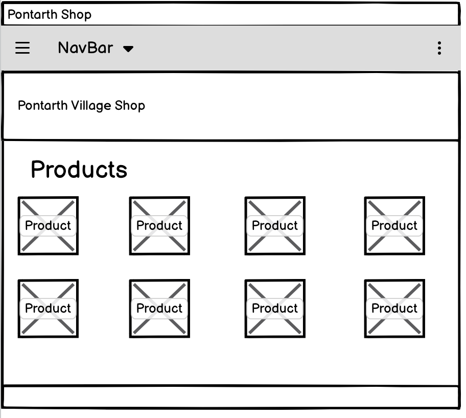
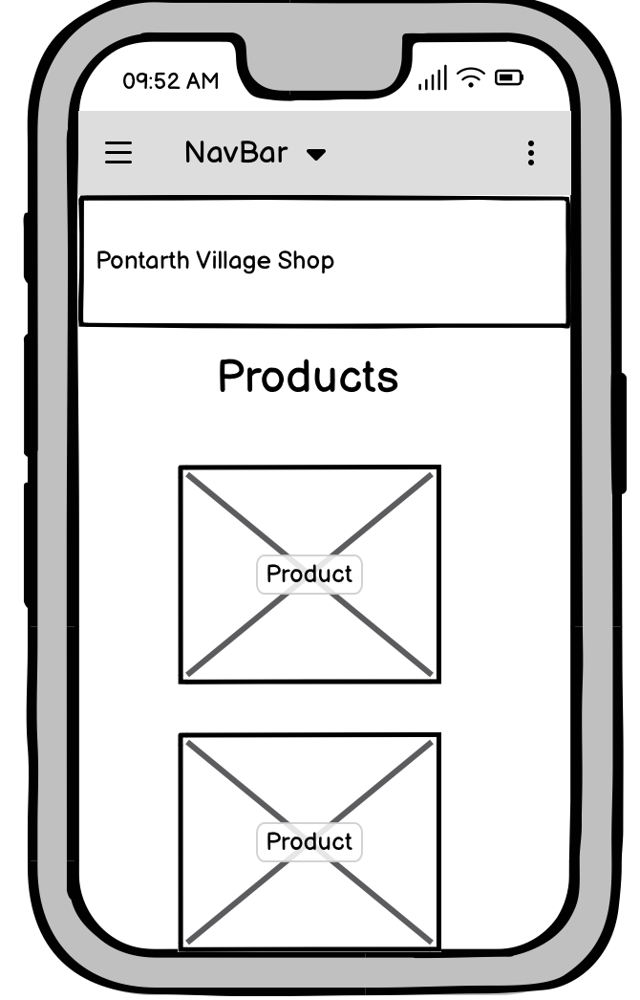
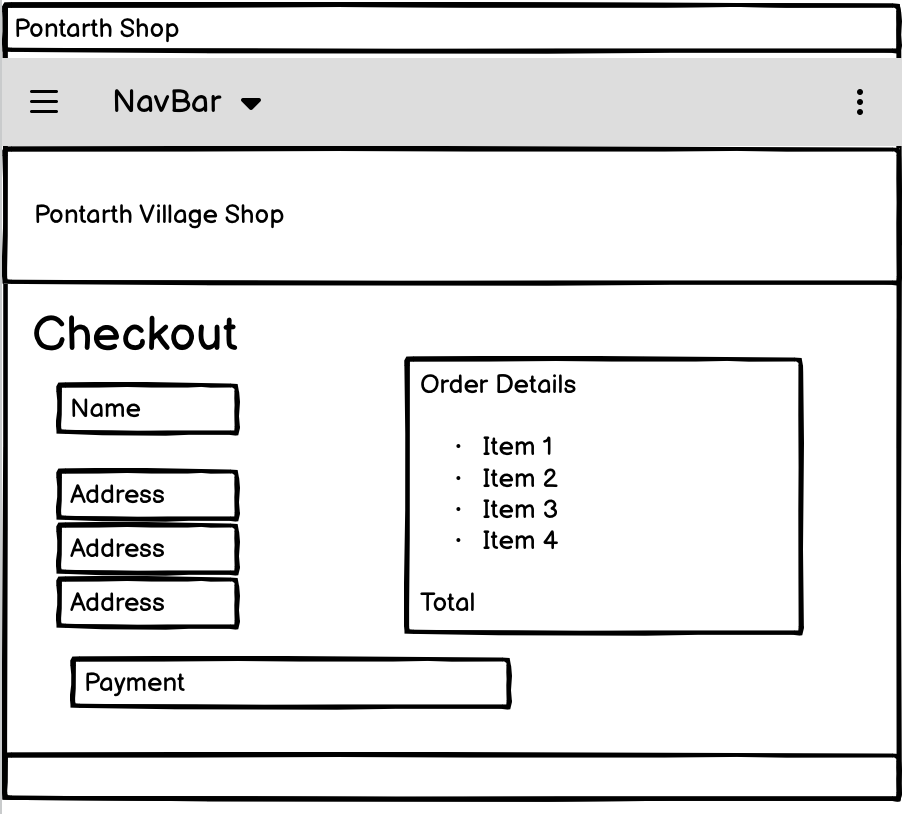
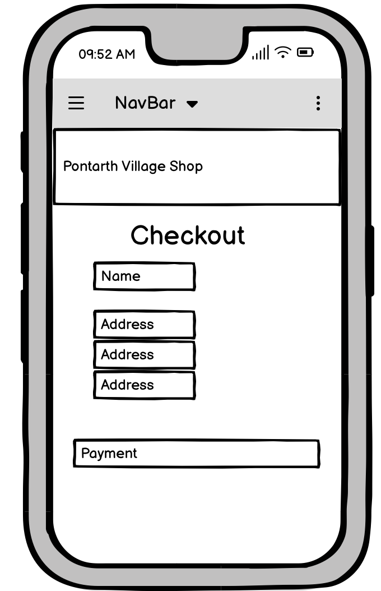

# Pontarth Village Shop

## Code Institute Milestone Project 4
A website where Pontarth's grocery sales, blog and events listing can share a single site.

# Initial Design
### Strategy
## Owner Key Goals:
- to sell groceries via Click & Collect Service
- to update locals via their blog
- to advertise events hosted at the shop's space

## Shopper Key Goals:
- to buy groceries quickly to pick up later
- to checkout latest news at the shop
- to find out more info about events
- to have my details stored for faster checkouts in future

## User Stories

### Navigation
| ID | As the ... | I want to ... | So that ... |
| ---|-----------|-------------|--------|
| 001 | Site visitor | be able to view all products in one page | I can browse all items |
| 002 | Site visitor | search for a specific item | So I don't have to manually search for something |
| 003 | Site visitor | view products by category | I can look for specific items within a section |
| 004 | Site visitor | See latest news first on the Updates page | I can see what the latest news is without having to go through the whole page |
| 005 | Site visitor | View more details on specific events | I can read up on any event I'm interested in |

### Accounts 
| ID | As the ... | I want to ... | So that ... |
| ---|-----------|-------------|--------|
| 006 | Site visitor | view the products, blog and events without creating an account | I can decide if I need to register first |
| 007 | Site visitor | create an account | my details are saved |
| 008 | Site visitor | update my password | to keep my account secure |
| 009 | Site owner | ensure my users are verified by email | to have a necessary security check |
| 010 | Site visitor | log in and out of my account as needed | to keep my information secure when I am not using the site |

### Admin 
| ID | As the ... | I want to ... | So that ... |
| ---|-----------|-------------|--------|
| 011 | Site owner | Create a blog post | I can share information with readers easily |
| 012 | Site owner | Edit a blog post | Make ad hoc changes to a published post |
| 013 | Site owner | Delete a blog post | Remove posts when they are no longer required. |
| 014 | Site owner | Add an event listing | I can create dedicated posts for events separate to blog posts |
| 015 | Site owner | Edit an event listing | I can make changes when an event is updated |
| 016 | Site owner | Delete an event listing | I can remove posts if an event is over or cancelled |
| 017 | Site owner | Add a new product | Add new items to sell |
| 018 | Site owner | Edit a product | I can change a product price or description without adding it brand new |
| 019 | Site owner | Delete a product | I can remove items no longer for sale |

### Purchases
| ID | As the ... | I want to ... | So that ... |
| ---|-----------|-------------|--------|
| 020 | Shopper | add items to my bag | they save and I can continue shopping |
| 021 | Shopper | edit quantity before adding an item to my bag | I can add multiple at once |
| 022 | Shopper | view the items in my bag | I can check what's saved |
| 023 | Shopper | proceed to checkout | begin the payment transaction |
| 024 | Shopper | enter my payment details securely | I feel like my information is safe |
| 025 | Shopper | be ifnromed when my payment is successful | I know the transaction is complete |

## Database Design
Based on the above initial designs, the database was designed with the following relationships using Figma:

# Frontend Design
## Wireframes

## Colour Scheme
- The colour scheme is black and white for a minimalistic look.
- Between the product images and blog/event images, there is already a lot of colour on these pages, and a monochromatic theme prevents clashes.
## Typography
- The fonts were selected to provide an academic vibe that wasn't overly formal. 
- From Google Fonts, 'Prata' was selected for the headers and some text. Times New Roman is also used to improve legibility.

## Technologies Used
### Languages
[HTML5](https://en.wikipedia.org/wiki/HTML5)
[CSS3](https://en.wikipedia.org/wiki/CSS)
[jQuery](https://jquery.com/)
[Python3](https://www.python.org/downloads/)

### Frameworks
- [Bootstrap 5](https://getbootstrap.com/)
- [Heroku](https://heroku.com/)
- [Django](https://getbootstrap.com/)
- [Elephantsql](https://www.elephantsql.com/)
- [Stripe](https://stripe.com/)
Stripe was used for payments on the site.
- [AWS](https://aws.amazon.com/)
Amazon S3 was used to manage media and static files.
 
# Testing

### Validation
- [W3C](https://validator.w3.org/) was used to validate the HTML. 
- [Jigsaw](https://jigsaw.w3.org/css-validator/) was used to validate the CSS.
- [JSHint](https://jshint.com/) was used to validate the JQuery.
- [CI Pep8 Linter](https://pep8ci.herokuapp.com/) was used to validate the Python code. 

## Device & Browser testing 
- System testing took place on the following devices:
- MacBook Air
- iPhone 12
- Unfortunately, no tablet was available for testing. I have used Chrome's Inspect tool for various tablets, however I know from experience this has limited accuracy. 

And on the following browsers:
- Safari
- Chrome
- Mozilla Firefox

## Manual Testing

| ID | As the ... | I want to ... | So that ... | How is this delivered |
| ---|-----------|-------------|--------|------------|
| 001 | Site visitor | be able to view all products in one page | I can browse all items | There is an 'All Products' section where all products are displayed on a scrollable page, which reduces in size depending on screen size.
| 002 | Site visitor | search for a specific item | So I don't have to manually search for something | A functioning search option is available within the navbar |
| 003 | Site visitor | view products by category | I can look for specific items within a section | Products are broken down into categories, enabling a smaller section of items to be browsed. |
| 004 | Site visitor | See latest news first on the Updates page | I can see what the latest news is without having to go through the whole page | Blog posts are displayed with the latest one at the top. |
| 005 | Site visitor | View more details on specific events | I can read up on any event I'm interested in | Events are displayed on the News page and can be selected individually to open a page with more details |
| 006 | Site visitor | view the products, blog and events without creating an account | I can decide if I need to register first | Login details are not required to browse items, view the News page or open event pages. |
| 007 | Site visitor | create an account | my details are saved | Tested account registration and email verification successfully. |
| 008 | Site visitor | update my password | to keep my account secure | Users are able to change their password |
| 009 | Site owner | ensure my users are verified by email | to have a necessary security check | On registering for an account, the user can expect to receive an email to confirm and complete verification. |
| 010 | Site visitor | log in and out of my account as needed | to keep my information secure when I am not using the site | Users can log in and log out from the navbar. |
| 011 | Site owner | Create a blog post | I can share information with readers easily | Admin can create a blog post from their account. |
| 012 | Site owner | Edit a blog post | Make ad hoc changes to a published post | Admin can edit a blog post |
| 013 | Site owner | Delete a blog post | Remove posts when they are no longer required. | Admin can delete a blog post |
| 014 | Site owner | Add an event listing | I can create dedicated posts for events separate to blog posts | Admin can create an event listing |
| 015 | Site owner | Edit an event listing | I can make changes when an event is updated | Admin can edit an event listing |
| 016 | Site owner | Delete an event listing | I can remove posts if an event is over or cancelled | Admin can delete an event listing |
| 017 | Site owner | Add a new product | Add new items to sell | Admin can add a product |
| 018 | Site owner | Edit a product | I can change a product price or description without adding it brand new | Admin can edit a product |
| 019 | Site owner | Delete a product | I can remove items no longer for sale | Admin can delete a product |
| 020 | Shopper | add items to my bag | they save and I can continue shopping | Pressing 'Add to Bag' button will add the item to the shopper's basket.
| 021 | Shopper | edit quantity before adding an item to my bag | I can add multiple at once | Increasing and decreasing the item quantity will then add that quantity when the user presses Add to Bag |
| 022 | Shopper | view the items in my bag | I can check what's saved | Clicking on the bag icon will take the user to view all items in their bag. They can update items from there. |
| 023 | Shopper | proceed to checkout | begin the payment transaction | User can select the checkout button from the bag to proceed to checkout |
| 024 | Shopper | enter my payment details securely | I feel like my information is safe | User enters details in a form to complete transaction with secure Stripe input for payment. |
| 025 | Shopper | be informed when my payment is successful | I know the transaction is complete | The success message displays when a transaction is completed. The order details can be found in the customer's account if they create one. |

# Deployment 
The following outlines the steps required to deploy the site:

## Basic Requirements
- IDE
- GitHub repository
- Heroku account
- Stripe account
- AWS S3 account
- Gmail account

## ElephantSQL
ElephantSQL was used to host the database.
- Navigate to [ElephantSQL](https://elephantsql.com)
- Click ‘Get a managed Database today”
- Select the Tiny Turtle option
- Select ‘Login with GitHub’ and authorize connection with your GitHub account
- Enter a team name and your email address, agree to ToS & GDPR then click ‘Create Team’
- Click ‘Create New Instance’
- Give your new plan a name and select the Tiny Turtle plan
- Press ’Select Region’ and pick the nearest location to yourself
- Click ‘Review’ and check your details are correct
- Click ‘Create Instance’

## Program modification
In order to connect with Heroku, the following amendments are required to the program:
- In your command line, enter: pip freeze — local > requirements.txt
- Within the root directory, create a file called Procfile
- Enter in this file: “web: python run.py”
- Open your settings file and make the following amendments to your if/else statement: 
if 'DATABASE_URL' in os.environ:
    DATABASES = {
        'default': dj_database_url.parse(os.environ.get('DATABASE_URL'))
    }
else:
    DATABASES = {
        'default': {
            'ENGINE': 'django.db.backends.sqlite3',
            'NAME': BASE_DIR / 'db.sqlite3',
        }
    }
- Save, push and commit changes

## Heroku
- Log into [Heroku](https://heroku.com), click ‘New’ 
- Click ‘Create a new app’
- Choose a unique name
- Select the region closest to yourself
- Click ‘ Create app’
- Go to Settings of the app
- Click ‘Reveal Config Vars’
- Return to ElephantSQL and copy the database URL found within Details
- In Heroku, add a Config Var called DATABASE_URL and paste the ElephantSQL URL in, then press ‘Add’
- Navigate to ‘Deploy’
- Select ‘Connect to GitHub’
- Search for your repository then click ‘Connect’

## Deployment
- Back in the IDE, run python3 manage.py makemigrations then python3 manage.py migrate.
- Run python3 manage.py loaddata categories, then python3 manage.py loaddata products.
- Create a superuser to access the Django admin panel 
- Install the Heroku CLI and log in with heroku login -i.
- Run heroku config:set DISABLE_COLLECTSTATIC=1 --app appnamehere.
- Run git add ., git commit -m "Your commit message here", git push.
- Add the hostname of your Heroku app to 'ALLOWED HOSTS' in your settings.py file. 
- Connect Heroku to Git by running: git remote add heroku {heroku git url}.
- Go to the 'Deploy' tab in Heroku, and click 'Enable Automatic Deployment'.
- Click 'Deploy Branch' to deploy your app onto the Heroku servers.
- Once the app has finished building, click 'Open App' to open your site.

## AWS
- In AWS S3, create a new bucket
- In Properties, turn on static website hosting.
- In Permissions, set up the CORS config to link Heroku and your S3 bucket.
- Go to 'Bucket Policy' >  'Edit' > 'Policy Generator'.
- In 'Select Type of Policy' choose 'S3 Bucket Policy'.
- In 'Add Statements', select 'Effect' of Allow, enter * into 'Principal', in 'Actions' choose GetObject, enter your ARN from your main S3 Bucket page, and click 'Add Statement'.
- Click 'Generate' and copy and paste your generated policy into the Bucket Policy area.
- Add /* at the end of the 'Resource' line, and save.
- Still in 'Permissions', go to the 'Access Control List', and select List next to 'Everyone'.

## IAM 
- Go to 'User Groups' > 'Create New Group', enter a name and click 'Create'.
- In 'Policies' navigate to 'Create New Policy' > 'JSON' > 'Import Managed Policy' > 'S3' > 'AmazonS3FullAccess' > 'Import'.
- Get the ARN from 'S3 Permissions'
- Click 'Next', 'Review', provide a name and description, and click 'Create Policy'.
- Go to 'User Groups' > 'Find New Group' > 'Permissions' > 'Add Permissions' > 'Attach Policies', then find the policy you created and click 'Add Permissions'.
- Go to 'Users', provide a name, and tick the checkbox beside 'Access key - Programmatic access'.
- Click 'Next', select the group you created, and click through to the end.
- Finally, click 'Create User' and download the CSV file, which will contain your AWS_SECRET_ACCESS_KEY and your AWS_ACCESS_KEY_ID. 

## Complete deployment
- Remove the DISABLE_COLLECTSTATIC variable from your environment variables.
- S3 now contains a static folder with your files.
- Create a media file in your S3 Bucket, click 'Upload'.
- Click 'Add Files', then select all your product images.
- Under 'Manage Public Permissions', select 'Grant Public Read Access'.
- Click Upload

## Change Email
- Log in to your GMail
- Go to Settings > Accounts and Imports > Other Google Account Settings
- Go to the 'Security' tab, and scroll to 'Signing in to Google'.
- Click on '2-step Verification', click 'Get Started', and enter your Gmail password.
- Turn on 2-step verification.
- Back in Security, go back to 'Signing in to Google', then go to 'App Passwords'.
- Enter your password again if prompted, then set 'App' to 'Mail', 'Device' to 'Other', and type in Django.
- Copy and paste the passcode that shows up, this is your 'EMAIL_HOST_PASS' variable.

# References

## Code
- Gallery Home Page: [W3 Schools](https://www.w3schools.com/howto/howto_css_image_grid_responsive.asp)

## Images
### Products
All product images were taken from Pxhere. All but one require no further specific credit.
- [Milk](https://pxhere.com/en/photo/648665)
- [Sourdough](https://pxhere.com/en/photo/1073302)
- [Seeded loaf](https://pxhere.com/en/photo/1073302)
- [White bread by Alan Levine](https://pxhere.com/en/photo/359031)
- [Honey](https://pxhere.com/en/photo/964038)
- [Yoghurt](https://pxhere.com/en/photo/1071139)
- [Butter](https://pxhere.com/en/photo/606569)
- [Eggs](https://pxhere.com/en/photo/629033)
- [Orange juice](https://pxhere.com/en/photo/1373092)
- [Apple juice](https://pxhere.com/en/photo/1579649)
- [Coffee beans](https://pxhere.com/en/photo/633541)
- [Tea bags](https://pxhere.com/en/photo/1156760)
- [Sugar](https://pxhere.com/en/photo/920092)
- [Jam](https://pxhere.com/en/photo/760768)
- [Apples](https://pxhere.com/en/photo/781337)
- [Bananas](https://pxhere.com/en/photo/1360400)
- [Berries](https://pxhere.com/en/photo/1159521)
- [Oranges](https://pxhere.com/en/photo/941567)
- [Potatoes](https://pxhere.com/en/photo/947460)
- [Tomatoes](https://pxhere.com/en/photo/1362673)
- [Broccoli](https://pxhere.com/en/photo/1048649)
- [Veg box](https://pxhere.com/en/photo/879579)
- [Biscuits](https://pxhere.com/en/photo/1267178)
- [Chocolate](https://pxhere.com/en/photo/898525)
- [Cheddar](https://pxhere.com/en/photo/1158281)
- [Brie](https://pxhere.com/en/photo/1158330)
- [Blue cheese](https://pxhere.com/en/photo/30722)
- [Crackers](https://pxhere.com/en/photo/1247287)
- [Crisps](https://pxhere.com/en/photo/1333331)
- [Pasta](https://pxhere.com/en/photo/1091335)

### Other Images
- Bear Logo is from [Flaticon](https://www.flaticon.com/free-icon/bear_185685?term=bear&page=1&position=3&origin=tag&related_id=185685)
- Gallery images are from Pexels:
- [Man in apron, Antoni Shkraba](https://www.pexels.com/photo/man-wearing-an-apron-7175967/)
- [Cheeseboard, Engin Akyurt](https://www.pexels.com/photo/food-on-brown-board-2531189/)
- [Group working, Helena Lopes](https://www.pexels.com/photo/a-man-in-black-jacket-reading-a-book-3471028/)
- [Paint pots, Jadson Thomas](https://www.pexels.com/photo/pain-brushes-inside-clear-plastic-cups-542556/)
- [Brown bag, Lisa Fotios](https://www.pexels.com/photo/brown-paper-bag-1992913/)
- [Market veg, Mark Stebnicki](https://www.pexels.com/photo/pile-of-assorted-varieties-of-vegetables-2255935/)
- [Clay, Natallia Rak](https://www.pexels.com/photo/person-making-clay-pot-1675993/)
- [Art Class, Rdne](https://www.pexels.com/photo/a-painter-painting-on-white-canvas-5756953/)
- [Workshop, RFStudio](https://www.pexels.com/search/group%20discussion/)
- [Bread, Ron Lach](https://www.pexels.com/photo/a-person-holding-the-fresh-bread-8180061/)
- [Thread, Suzy Hazelwood](https://www.pexels.com/photo/assorted-color-button-pin-on-brown-surface-1232131/)

## Media
- [Font Awesome](https://fontawesome.com/) for icons throughout the project
- [Google Fonts](https://fonts.google.com/) for the fonts used in the project

